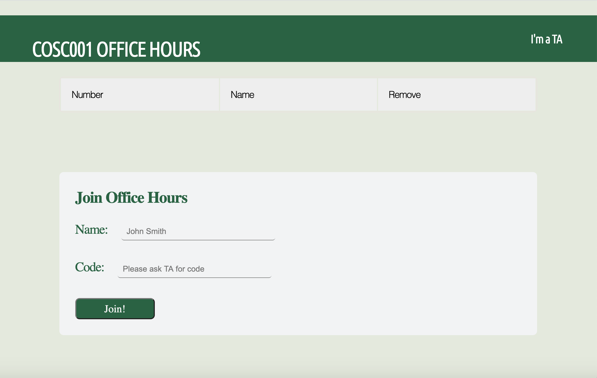

# office-hours-queue

For many of the larger CS classes, office hours are filled with students seeking help with labs.  
With no system to remember who comes in at what time, it is easy for students who have just entered office hours to
get help before the students who have been waiting for an hour. It can also be overwhelming for the TA's running office hours
to try to keep track of who came in when. I hope to create a queue website for office hours to help avoid these problems.

The goal is to have each student who enters office hours log-in with their student ID, choose which course they are in, enter the code that the TA writes on the whiteboard
or provides over email/zoom chat (if remote learning), and join the queue. The student can remove only themselves from the queue at any time. If a TA log-in is recognized, they will be directed to the TA page, where they create the code to begin office hours, and can remove any student from the queue.

Currently, the site does not have all of the mentioned functionality. I plan to continue to implement functionality as I learn more web development, as I hope to take the web development course next term.

### Current functionality:

- Only available for COSC001
- Queue only updated on current page
- Queue numbers updated
- Can remove selected row
- Enter code that matches TA code to join

### Future functionality:

- Select COSC001, COSC010, COSC050
- Update queue content through ajax across computers and browsers
- Remove button for row only appears if you are the student in the row
- Queue table shown on TA page, TA can remove any student

